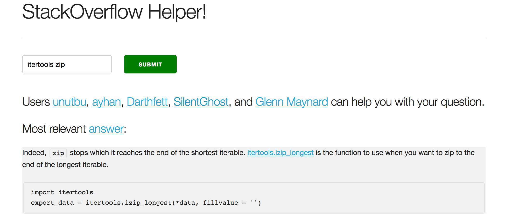

# StackOverflow-Helper

Metis Project #4 - Natural Language Processing

A Flask web app that allows one to search the most relevant Python StackOverflow answers based on keywords. This works offline but only has answers up to October 19, 2016. Uses cosine similarity to score keyword matching. Produces the top matched search result (akin to Google's I'm Feeling Lucky). The main portion of the code is in the [views.py](app/views.py) file.

To use:  

Clone or download the repo.
Check the dependencies and install any missing modules.   
Download the answers.csv dataset from [here](https://www.kaggle.com/stackoverflow/pythonquestions) and place it in this directory.
Run the [soh_pickler.py](soh_pickler.py) file from a command line.
Run the [run.py](run.py) file.
Open `localhost:9000` in a web browser.

